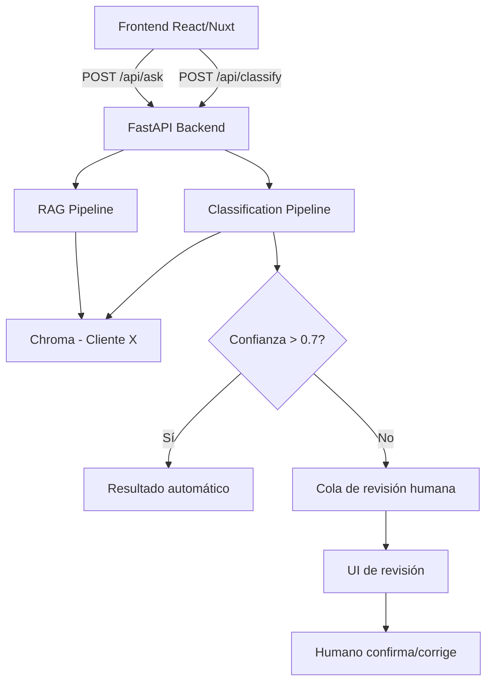

# Local RAG Assistant — Learning Roadmap

> Ruta de aprendizaje personalizada para un FE developer que quiere dominar el
> ciclo completo de integración de modelos de IA en productos reales.
>
> **Dedicación**: 45-60 min/día, lunes a viernes (~3-4 semanas)
> **Formato**: Leer y entender el concepto → implementar → verificar

---

## Mapa de la ruta

```
M0: Fundamentos 🧠           (1 sesión)
M1: Esqueleto del proyecto 🏗️           (3 sesiones)
M2: Documentos y Loaders 📄              (3 sesiones)
M3: Embeddings + Vector Store 🔍         (3 sesiones)
M4: Generación + RAG completo 🤖         (3 sesiones)
M5: Evaluación + Structured Output ✅    (3 sesiones)  ← CLAVE para tu caso de clasificación
M6: Salto a tu producto 🚀              (1 sesión)
                                   ——————————
                                   ~17 sesiones
```

Cada sesión = 45-60 min. Avanzas a tu ritmo. Cada sesión deja algo funcionando.

---

## 📘 Estructura de cada sesión

Cada entrada sigue este formato:

```
## Sesión X.Y: Nombre

### Leer / Entender (20-25 min)
- Conceptos clave
- Referencias al plan de implementación
- Por qué es importante PARA TUS CASOS

### Implementar (25-30 min)
- Archivos a crear/modificar
- Código mínimo para que funcione
- Cómo verificarlo

### Checkpoint
- Comando o test que confirma que funciona
```

---

## 🧠 Módulo 0: Fundamentos (1 sesión)

### Sesión 0.1: Conceptos esenciales + Ollama

#### Leer / Entender

| Concepto | Qué es | Por qué importa |
|----------|--------|-----------------|
| **Embedding** | Texto → vector de números (768 para nomic-embed-text). Textos parecidos → vectores cercanos. | Sin esto no hay búsqueda semántica. Tu chatbot necesita encontrar documentos relevantes aunque no contengan las palabras exactas de la pregunta. |
| **Vector store** | Base de datos que busca por similitud de vectores (coseno, dot product). Chroma es embedded, sin servidor. | Aquí se guardan los trozos de tus documentos para buscarlos después. |
| **LLM** | Modelo que genera texto. Se configura con temperature, top_p, system prompt, max_tokens. | Es el cerebro que responde. Controlarlo es clave para que no invente. |
| **RAG** | Recuperar documentos relevantes → darlos como contexto al LLM → responde con fuentes. | El patrón que resuelve alucinaciones y da respuestas basadas en datos reales. |
| **Ollama** | Runtime local de modelos. Metal-native en Apple Silicon. API compatible con OpenAI. | Te permite correr modelos en tu máquina, sin internet, sin pagar por API. |

Recursos:
- [Ollama docs](https://github.com/ollama/ollama) — leer la página de GitHub
- `docs/plans/local-rag-assistant/IMPLEMENTATION_PLAN.md` — secciones 1.1 a 1.4 (Stack, Diagrama, Data Flow, Configuración)

#### Implementar

```bash
# Instalar Ollama (si no lo tienes)
brew install ollama

# Descargar modelos (~2.3 GB total, solo una vez)
ollama pull llama3.2:3b-instruct-q4_K_M
ollama pull nomic-embed-text:v1.5

# Probar que funciona
ollama run llama3.2:3b-instruct-q4_K_M
# Escribe: "Hola, dime qué puedes hacer" y juega con el modelo
# Prueba: cambia la temperatura (en MacOllama o con API)
# Sal con /bye
```

#### Checkpoint
- `ollama list` muestra ambos modelos
- `ollama run llama3.2:3b-instruct-q4_K_M` responde en terminal
- `ollama ps` muestra al menos un modelo cargado

**Entender para tu producto**: Abre `ollama run` y prueba preguntas relacionadas con tu dominio (legal, patentes). Observa cómo responde con y sin contexto. Esto te da intuición sobre lo que el modelo puede y no puede hacer.

---

## 🏗️ Módulo 1: Esqueleto del proyecto (3 sesiones)

### Sesión 1.1: Scaffold + pyproject.toml

#### Leer / Entender

Conceptos:
- **pyproject.toml**: El estándar moderno de empaquetado Python. Define dependencias, metadatos, entry points.
- **src/ layout**: Por qué `src/rag_assistant/` y no código en la raíz (evita conflictos de import, separa librería de config).
- **pip install -e .**: Instala el paquete en modo editable — cualquier cambio en `src/` se refleja sin reinstalar.
- **Virtual environments**: Aísla dependencias del sistema.

Referencia en el plan: Sección 2.2, Milestone 1.1, unidades 1.1.a, 1.1.b, 1.1.c.

**Para tu producto**: La estructura de un proyecto Python bien hecho es la base de cualquier backend de IA. Este mismo patrón lo usarás para el servicio que integres en tu producto.

#### Implementar

```bash
# Crear estructura de directorios
mkdir -p src/rag_assistant/{loaders,adapters,importers}
mkdir -p tests/fixtures tests/eval
mkdir -p docs data/chroma scripts web
```

Crear `pyproject.toml`:

```toml
[build-system]
requires = ["setuptools>=68.0"]
build-backend = "setuptools.backends._legacy:_Backend"

[project]
name = "rag-assistant"
version = "0.1.0"
description = "Local RAG assistant — CLI-first, privacy-first"
requires-python = ">=3.11, <3.14"
dependencies = [
    "chromadb>=1.0.0",
    "typer>=0.9.0",
    "pydantic>=2.0.0",
    "pydantic-settings>=2.0.0",
    "httpx>=0.27.0",
    "tenacity>=8.0.0",
    "pyyaml>=6.0.0",
]

[project.scripts]
rag = "rag_assistant.cli:app"

[tool.setuptools.packages.find]
where = ["src"]
```

Crear `src/rag_assistant/__init__.py` (vacio).

Crear archivos vacíos para la estructura:
```bash
touch src/rag_assistant/{cli.py,config.py,exceptions.py,documents.py,sources.py,ingest.py,query.py,interfaces.py,models.py}
touch src/rag_assistant/loaders/__init__.py
touch src/rag_assistant/adapters/__init__.py
touch src/rag_assistant/importers/__init__.py
touch tests/__init__.py tests/conftest.py
touch web/__init__.py web/app.py
```

```bash
# Crear y activar entorno virtual
python3.11 -m venv .venv  # o python3.12 si no tienes 3.11
source .venv/bin/activate

# Instalar en modo editable
pip install -e .
```

#### Checkpoint
- `pip list | grep rag-assistant` muestra el paquete instalado
- `python -c "import rag_assistant; print('OK')"` no da error

---

### Sesión 1.2: Config y Excepciones

#### Leer / Entender

Conceptos:
- **pydantic-settings**: Carga configuración de env vars + `.env` con validación de tipos. Mejor que `os.environ`.
- **Jerarquía de excepciones**: Excepciones propias para cada capa (config, ingest, query). El CLI captura la base y muestra mensajes limpios al usuario.
- **`.env.example`**: Documenta todas las variables de configuración. El usuario copia a `~/.config/rag-assistant/.env`.

Referencia: Sección 1.4 (Configuration Schema), unidades 1.1.d, 1.1.e.

**Para tu producto**: Tu producto tendrá decenas de configuraciones (modelo, endpoint, API keys, etc.). Este patrón escala directamente.

#### Implementar

**`src/rag_assistant/exceptions.py`**:

```python
class RAGError(Exception):
    def __init__(self, message: str, user_message: str | None = None):
        self.message = message
        self.user_message = user_message or message
        super().__init__(self.message)

class ConfigError(RAGError): ...
class SourceImportError(RAGError): ...
class IngestionError(RAGError): ...
class QueryError(RAGError): ...
```

**`src/rag_assistant/config.py`**:

```python
from pydantic_settings import BaseSettings
from pathlib import Path

class Settings(BaseSettings):
    model_config = {"env_file": "~/.config/rag-assistant/.env", "env_file_encoding": "utf-8"}

    source_type: str = "local"
    ollama_base_url: str = "http://localhost:11434"
    llm_provider: str = "ollama"
    llm_profile: str = "fast"
    llm_model: str = "llama3.2:3b-instruct-q4_K_M"
    embedding_model: str = "nomic-embed-text:v1.5"
    embedding_document_prefix: str = "search_document: "
    embedding_query_prefix: str = "search_query: "
    chroma_persist_dir: str = "data/chroma/"
    docs_dir: str = "docs/"
    supported_extensions: str = ".md,.txt,.json,.yaml,.yml"
    log_level: str = "INFO"
    log_file: str = "data/rag.log"
    exclude_patterns: str = ""

def get_settings() -> Settings:
    return Settings()
```

#### Checkpoint
- `python -c "from rag_assistant.config import get_settings; s = get_settings(); print(s.llm_model)"` imprime `llama3.2:3b-instruct-q4_K_M`

---

### Sesión 1.3: CLI skeleton con Typer

#### Leer / Entender

Conceptos:
- **Typer**: CLI con type hints. Autogenera `--help`. Subcomandos anidados.
- **Entry points**: `[project.scripts]` en `pyproject.toml` mapea `rag` a `cli.py:app`.
- **Subcomandos**: `rag ingest`, `rag ask`, `rag status`, etc., son funciones decoradas con `@app.command()`.

Referencia: Unidad 1.1.f, Sección 6.2 (Diagnostic CLI Commands).

**Para tu producto**: Typer es ideal para herramientas internas, devops, y pipelines. Mismo patrón que FastAPI (mismo autor).

#### Implementar

**`src/rag_assistant/cli.py`**:

```python
import typer
from typing import Optional

app = typer.Typer(name="rag", help="Local RAG assistant")

@app.command()
def ingest(
    dry_run: bool = typer.Option(False, "--dry-run", help="Preview without indexing")
):
    """Scan docs/, chunk, embed, and store in Chroma"""
    typer.echo("Ingest: not yet implemented" + (" (dry-run)" if dry_run else ""))

@app.command()
def ask(question: str = typer.Argument(None, help="Your question")):
    """Ask a question against indexed documents"""
    if not question:
        typer.echo("Usage: rag ask '<your question>'")
        raise typer.Exit(1)
    typer.echo(f"Ask: not yet implemented (question: {question})")

@app.command()
def search(query: str = typer.Argument(..., help="Search query")):
    """Retrieve relevant chunks without LLM generation"""
    typer.echo(f"Search: not yet implemented (query: {query})")

@app.command()
def status():
    """Show current index state and configuration"""
    typer.echo("Status: not yet implemented")

@app.command()
def inspect(path: str = typer.Argument(..., help="Path to a document")):
    """Show normalized Document for one file"""
    typer.echo(f"Inspect: not yet implemented (path: {path})")

@app.command()
def check():
    """Verify environment is ready for RAG operations"""
    typer.echo("Check: not yet implemented")

@app.command(name="reset-index")
def reset_index():
    """Delete Chroma index and manifest (with confirmation)"""
    typer.echo("Reset-index: not yet implemented")

@app.command()
def eval():
    """Run evaluation set"""
    typer.echo("Eval: not yet implemented")

if __name__ == "__main__":
    app()
```

#### Checkpoint
- `rag --help` muestra todos los comandos
- `rag ask "test"` imprime el mensaje placeholder
- `rag ask` sin argumentos muestra usage y exit code 1
- `rag --version` imprime la version

**Lo que has aprendido hasta aquí**: Estructura de proyecto Python, configuración con pydantic, CLI con Typer, manejo de errores con jerarquía de excepciones. Esto es la base de CUALQUIER backend de IA.

---

## 📄 Módulo 2: Documentos y Loaders (3 sesiones)

### Sesión 2.1: Document model + Source discovery

#### Leer / Entender

Conceptos:
- **Loader-first architecture**: Cada formato tiene un loader. Todos devuelven el mismo `Document`. El resto del pipeline (chunking, embedding, query) nunca ve el formato original.
- **`Document` como contrato**: `id`, `title`, `text`, `format`, `source_file`, `metadata`. Es el "DTO" del pipeline.
- **Source discovery**: Escanear `docs/` recursivamente, filtrar por extensiones soportadas, respetar exclude patterns.
- **SHA256**: Hash del archivo completo para saber si cambió.

**Para tu producto**: Este es EL patrón más importante. Documentos legales, reportes de patentes, PDFs, todos se normalizan a un modelo común. Si en el futuro añades un nuevo formato (DOCX, HTML), solo creas un loader nuevo sin tocar nada más.

Referencia: Sección 2.2, Milestone 1.2, unidades 1.2.a, 1.2.b, 1.2.f.

#### Implementar

**`src/rag_assistant/documents.py`**:

```python
from pydantic import BaseModel, Field
from pathlib import Path
from datetime import datetime

class Document(BaseModel):
    id: str
    title: str
    text: str
    format: str  # "markdown", "text", "json", "yaml", "recipe"
    source_file: Path
    metadata: dict = Field(default_factory=dict)
```

**`src/rag_assistant/sources.py`**:

```python
from pathlib import Path
from config import get_settings

def discover_supported_files() -> list[Path]:
    settings = get_settings()
    docs_dir = Path(settings.docs_dir)
    if not docs_dir.exists():
        return []
    extensions = tuple(settings.supported_extensions.split(","))
    return sorted([p for p in docs_dir.rglob("*") if p.suffix in extensions and not p.name.startswith(".")])
```

#### Checkpoint
- Crea `docs/test.md` con contenido cualquiera
- `python -c "from rag_assistant.sources import discover_supported_files; print(discover_supported_files())"` muestra el archivo

---

### Sesión 2.2: Loaders (Markdown + Plain Text)

#### Leer / Entender

Conceptos:
- **Loader registry**: Un dict que mapea extensión → función loader.
- **Markdown loader**: Extrae título (primer H1), preserva jerarquía de headings para chunking.
- **Text loader**: Título de la primera línea o filename.
- **Fixture tests**: Archivos de prueba pequeños y predecibles.

Referencia: Unidades 1.2.c, 1.2.d, 1.2.f, 1.2.m.

**Para tu producto**: Aquí ves cómo se extrae metadata (título, headings) de documentos no estructurados. En tu caso, podrías tener loaders específicos para formatos de reportes legales.

#### Implementar

**`src/rag_assistant/loaders/__init__.py`**:

```python
from pathlib import Path
from rag_assistant.documents import Document

LOADER_REGISTRY: dict[str, callable] = {}

def register_loader(extension: str):
    def decorator(func):
        LOADER_REGISTRY[extension] = func
        return func
    return decorator

def load_document(path: Path) -> Document:
    ext = path.suffix.lower()
    loader = LOADER_REGISTRY.get(ext)
    if not loader:
        raise ValueError(f"No loader for extension: {ext}")
    return loader(path)
```

**`src/rag_assistant/loaders/text.py`**:

```python
from pathlib import Path
from rag_assistant.documents import Document
from . import register_loader

@register_loader(".txt")
def load_text(path: Path) -> Document:
    text = path.read_text(encoding="utf-8")
    lines = text.strip().split("\n")
    title = lines[0].strip() if lines else path.stem
    return Document(
        id=path.stem,
        title=title,
        text=text,
        format="text",
        source_file=path,
        metadata={},
    )
```

**`src/rag_assistant/loaders/markdown.py`**:

```python
from pathlib import Path
from rag_assistant.documents import Document
from . import register_loader

@register_loader(".md")
def load_markdown(path: Path) -> Document:
    text = path.read_text(encoding="utf-8")
    title = path.stem
    for line in text.split("\n"):
        if line.startswith("# "):
            title = line.lstrip("# ").strip()
            break
    return Document(
        id=path.stem,
        title=title,
        text=text,
        format="markdown",
        source_file=path,
        metadata={"heading_count": text.count("\n#") + text.count("\n##")},
    )
```

**Crear fixtures de prueba**:

`tests/fixtures/sample_doc_es.md`:
```markdown
# Documento de prueba

## Sección 1
Este es el contenido de la sección 1.

## Sección 2
Este es el contenido de la sección 2.
```

`tests/fixtures/sample_note.txt`:
```markdown
Nota de prueba
Esta es una nota de ejemplo.
Contiene varias líneas de texto.
```

**Test rápido**: `python -c "from rag_assistant.loaders import load_document; d = load_document(Path('tests/fixtures/sample_doc_es.md')); print(d.title, d.format)"`

#### Checkpoint
- `rag inspect tests/fixtures/sample_doc_es.md` muestra el Document normalizado
- `rag ingest --dry-run` lista los archivos encontrados

---

### Sesión 2.3: Structured Loader (JSON/YAML + Recipe)

#### Leer / Entender

Conceptos:
- **JSON/YAML loader**: Parsea con `json` o `yaml`, aplana a texto legible, preserva keys en metadata.
- **Recipe convention**: Si el JSON/YAML tiene campos como `ingredients`, `steps`, `tags`, se renderiza como receta con secciones.
- **Importancia para retrieval**: Un JSON plano no se busca bien. "Aplanarlo" a texto hace que la búsqueda semántica funcione.

**Para tu caso 2**: Este loader es la base de tu pipeline de clasificación. Tus reportes probablemente llegan como JSON/YAML. Aquí aprendes a extraer campos y normalizarlos para que el LLM los entienda.

Referencia: Unidad 1.2.e, ejemplo de receta en sección 1.3.

#### Implementar

**`src/rag_assistant/loaders/structured.py`**:

```python
from pathlib import Path
import json
import yaml
from rag_assistant.documents import Document
from . import register_loader

RECIPE_FIELDS = {"ingredients", "steps", "servings", "prep_time", "cook_time", "tags", "notes"}

def _flatten_to_text(data: dict) -> str:
    sections = []
    if "title" in data:
        sections.append(f"# {data['title']}")
    if "tags" in data and isinstance(data["tags"], list):
        sections.append(f"Tags: {', '.join(data['tags'])}")
    if "servings" in data:
        sections.append(f"Servings: {data['servings']}")
    if "prep_time" in data:
        sections.append(f"Prep time: {data['prep_time']}")
    if "cook_time" in data:
        sections.append(f"Cook time: {data['cook_time']}")
    if "ingredients" in data and isinstance(data["ingredients"], list):
        sections.append("Ingredients:\n" + "\n".join(f"- {i}" for i in data["ingredients"]))
    if "steps" in data and isinstance(data["steps"], list):
        sections.append("Steps:\n" + "\n".join(f"{n+1}. {s}" for n, s in enumerate(data["steps"])))
    if "notes" in data:
        sections.append(f"Notes: {data['notes']}")
    for key, value in data.items():
        if key not in RECIPE_FIELDS and key != "title":
            if isinstance(value, (str, int, float)):
                sections.append(f"{key}: {value}")
    return "\n\n".join(sections)

def _detect_recipe(data: dict) -> bool:
    return bool(RECIPE_FIELDS & set(data.keys()))

@register_loader(".json")
def load_json(path: Path) -> Document:
    data = json.loads(path.read_text(encoding="utf-8"))
    title = data.get("title", path.stem)
    is_recipe = _detect_recipe(data)
    text = _flatten_to_text(data) if isinstance(data, dict) else str(data)
    return Document(
        id=path.stem,
        title=title,
        text=text,
        format="recipe" if is_recipe else "json",
        source_file=path,
        metadata={"format": "json", "is_recipe": is_recipe},
    )

@register_loader(".yaml")
@register_loader(".yml")
def load_yaml(path: Path) -> Document:
    data = yaml.safe_load(path.read_text(encoding="utf-8"))
    title = data.get("title", path.stem) if isinstance(data, dict) else path.stem
    is_recipe = _detect_recipe(data) if isinstance(data, dict) else False
    text = _flatten_to_text(data) if isinstance(data, dict) else str(data)
    return Document(
        id=path.stem,
        title=title,
        text=text,
        format="recipe" if is_recipe else "yaml",
        source_file=path,
        metadata={"format": "yaml", "is_recipe": is_recipe},
    )
```

Crear fixture `tests/fixtures/sample_recipe.yaml`:
```yaml
title: Tortilla de patatas
tags: [receta, cena, española]
servings: 4
prep_time: 15 min
cook_time: 25 min
ingredients:
  - 4 patatas
  - 5 huevos
  - 1 cebolla
steps:
  - Pelar y cortar las patatas.
  - Freír a fuego medio.
  - Mezclar con huevo batido.
notes: Queda mejor reposando 5 minutos.
```

#### Checkpoint
- `rag inspect tests/fixtures/sample_recipe.yaml` muestra el texto aplanado con ingredientes y pasos
- El texto incluye "Ingredients:", "Steps:" como secciones legibles

---

## 🔍 Módulo 3: Embeddings + Vector Store (3 sesiones)

### Sesión 3.1: Interfaces del sistema

#### Leer / Entender

Conceptos:
- **Adapter pattern**: Definimos interfaces (`Embedder`, `VectorStore`) que el dominio usa. Las implementaciones concretas (Ollama, Chroma) se inyectan.
- **Protocols vs ABC**: Python `Protocol` para duck typing, o ABC para herencia. Usamos Protocol para no acoplar.
- **Por qué desacoplar**: Si mañana cambias Chroma por Qdrant, o Ollama por FastEmbed, cambias solo el adapter. El pipeline de ingestión y query no se toca.

**Para tu producto**: Esto es clave. Tu producto podría empezar con Ollama local y migrar a OpenAI o Claude sin reescribir nada. Solo cambias el adapter.

Referencia: Unidad 1.3.a.

#### Implementar

**`src/rag_assistant/interfaces.py`**:

```python
from typing import Protocol, list
from rag_assistant.documents import Document

class Embedder(Protocol):
    def embed_documents(self, texts: list[str]) -> list[list[float]]: ...
    def embed_query(self, text: str) -> list[float]: ...

class VectorStore(Protocol):
    def upsert(self, documents: list[Document], embeddings: list[list[float]]): ...
    def search(self, query_embedding: list[float], k: int = 5) -> list[dict]: ...
    def delete_by_source(self, source_file: str): ...
    def count(self) -> int: ...
    def clear(self): ...

class Retriever(Protocol):
    def retrieve(self, query: str, k: int = 5) -> list[dict]: ...

class Generator(Protocol):
    def generate(self, prompt: str, context: list[dict]) -> str: ...
    def stream(self, prompt: str, context: list[dict]): ...
```

#### Checkpoint
- `python -c "from rag_assistant.interfaces import Embedder; print(type(Embedder))"` no da error
- Los protocolos son solo tipos, no hay nada que "ejecutar" aún

---

### Sesión 3.2: Adapter de Ollama

#### Leer / Entender

Conceptos:
- **Ollama API**: `POST /api/embed` para embeddings, `POST /api/generate` para generación. API REST sencilla.
- **Task prefixes**: `search_document:` para chunks indexados, `search_query:` para preguntas. Mejora la calidad de retrieval.
- **httpx**: Cliente HTTP moderno para Python. Timeouts, manejo de errores.
- **nomic-embed-text**: 768 dimensiones, Matryoshka representation, optimizado para retrieval.

Referencia: Unidad 1.3.b.

**Para tu producto**: Aquí ves cómo se comunica tu backend con el modelo. Mismo patrón para llamar a cualquier LLM (Ollama, OpenAI, Anthropic).

#### Implementar

**`src/rag_assistant/adapters/ollama.py`**:

```python
import httpx
from rag_assistant.config import get_settings

class OllamaEmbedder:
    def __init__(self):
        settings = get_settings()
        self.base_url = settings.ollama_base_url
        self.model = settings.embedding_model
        self.doc_prefix = settings.embedding_document_prefix
        self.query_prefix = settings.embedding_query_prefix

    def embed_documents(self, texts: list[str]) -> list[list[float]]:
        prefixed = [f"{self.doc_prefix}{t}" for t in texts]
        return self._embed(prefixed)

    def embed_query(self, text: str) -> list[float]:
        prefixed = f"{self.query_prefix}{text}"
        return self._embed([prefixed])[0]

    def _embed(self, texts: list[str]) -> list[list[float]]:
        with httpx.Client(timeout=60.0) as client:
            resp = client.post(
                f"{self.base_url}/api/embed",
                json={"model": self.model, "input": texts},
            )
            resp.raise_for_status()
            return resp.json()["embeddings"]
```

#### Checkpoint
- `python -c "from rag_assistant.adapters.ollama import OllamaEmbedder; e = OllamaEmbedder(); v = e.embed_query('test'); print(len(v))"` imprime `768`
- `python -c "from rag_assistant.adapters.ollama import OllamaEmbedder; e = OllamaEmbedder(); v = e.embed_documents(['hola', 'mundo']); print(len(v), len(v[0]))"` imprime `2, 768`

---

### Sesión 3.3: Adapter de Chroma + Pipeline de ingestión

#### Leer / Entender

Conceptos:
- **Chroma**: Colección = tabla de vectores. Cada entrada tiene: id, embedding, metadata (dict), texto original.
- **Persistencia**: Chroma guarda en disco (`data/chroma/`). Persistente entre ejecuciones.
- **Incremental indexing**: SHA256 manifest → solo procesar archivos nuevos, cambiados o eliminados.
- **Chunking**: Dividir documentos grandes en trozos. Markdown por headings, texto por párrafos, structured por secciones.

Referencia: Milestone 1.3 (unidades 1.3.c, 1.3.d, 1.3.e, 1.3.f).

**Para tu producto**: El chunking es una de las decisiones más importantes en RAG. Si el chunk es muy pequeño, pierde contexto. Si es muy grande, el LLM se satura. Aquí experimentarás con eso.

#### Implementar

**`src/rag_assistant/adapters/chroma.py`**:

```python
import chromadb
from pathlib import Path
from rag_assistant.config import get_settings

class ChromaStore:
    def __init__(self):
        settings = get_settings()
        persist_dir = Path(settings.chroma_persist_dir)
        persist_dir.mkdir(parents=True, exist_ok=True)
        self.client = chromadb.PersistentClient(path=str(persist_dir))
        self.collection = self.client.get_or_create_collection(
            name="local_docs",
            metadata={"hnsw:space": "cosine"},
        )

    def upsert(self, ids: list[str], embeddings: list[list[float]], metadatas: list[dict], documents: list[str]):
        self.collection.upsert(
            ids=ids,
            embeddings=embeddings,
            metadatas=metadatas,
            documents=documents,
        )

    def search(self, query_embedding: list[float], k: int = 5) -> list[dict]:
        results = self.collection.query(
            query_embeddings=[query_embedding],
            n_results=k,
        )
        return [
            {
                "id": results["ids"][0][i],
                "document": results["documents"][0][i],
                "metadata": results["metadatas"][0][i],
                "score": results["distances"][0][i] if results.get("distances") else 0,
            }
            for i in range(len(results["ids"][0]))
        ]

    def delete_by_source(self, source_file: str):
        self.collection.delete(where={"source_file": source_file})

    def count(self) -> int:
        return self.collection.count()

    def clear(self):
        self.client.delete_collection("local_docs")
        self.collection = self.client.get_or_create_collection(name="local_docs")
```

**`src/rag_assistant/ingest.py`** (pipeline básico):

```python
import json
import hashlib
from pathlib import Path
from rag_assistant.sources import discover_supported_files
from rag_assistant.loaders import load_document
from rag_assistant.adapters.ollama import OllamaEmbedder
from rag_assistant.adapters.chroma import ChromaStore
from rag_assistant.config import get_settings

MANIFEST_PATH = Path("index_manifest.json")

def _sha256(path: Path) -> str:
    return hashlib.sha256(path.read_bytes()).hexdigest()

def _chunk_document(doc) -> list[tuple[str, dict]]:
    """Simple chunking: split by double newlines or headings"""
    chunks = []
    text = doc.text
    if doc.format == "markdown":
        sections = text.split("\n## ")
        for i, section in enumerate(sections):
            chunk_text = section.strip()
            if len(chunk_text) < 50:
                continue
            chunk_id = f"{doc.id}_chunk_{i:03d}"
            metadata = {
                "source_file": str(doc.source_file),
                "document_title": doc.title,
                "chunk_index": i,
                "format": doc.format,
            }
            chunks.append((chunk_text, metadata))
    else:
        paragraphs = [p.strip() for p in text.split("\n\n") if p.strip()]
        for i, para in enumerate(paragraphs):
            if len(para) < 50:
                continue
            chunk_id = f"{doc.id}_chunk_{i:03d}"
            metadata = {
                "source_file": str(doc.source_file),
                "document_title": doc.title,
                "chunk_index": i,
                "format": doc.format,
            }
            chunks.append((para, metadata))
    return chunks

def run_ingest(dry_run: bool = False) -> dict:
    settings = get_settings()
    files = discover_supported_files()
    manifest = {}
    if MANIFEST_PATH.exists():
        manifest = json.loads(MANIFEST_PATH.read_text())

    new_files, changed_files, deleted_files, unchanged = [], [], [], []

    current_paths = set()
    for f in files:
        current_paths.add(str(f))
        sha = _sha256(f)
        prev = manifest.get(str(f))
        if prev is None:
            new_files.append(f)
        elif prev["sha256"] != sha:
            changed_files.append(f)
        else:
            unchanged.append(f)

    for key in manifest:
        if key not in current_paths:
            deleted_files.append(key)

    if dry_run:
        return {
            "new": len(new_files),
            "changed": len(changed_files),
            "deleted": len(deleted_files),
            "unchanged": len(unchanged),
            "total": len(files),
        }

    embedder = OllamaEmbedder()
    store = ChromaStore()

    # Delete removed files
    for source in deleted_files:
        store.delete_by_source(source)
        del manifest[source]

    # Process new and changed
    processor = new_files + changed_files
    for f in processor:
        doc = load_document(f)
        chunks = _chunk_document(doc)
        texts = [c[0] for c in chunks]
        metadatas = [c[1] for c in chunks]
        ids = [f"{doc.id}_{i}" for i in range(len(chunks))]

        embeddings = embedder.embed_documents(texts)
        store.upsert(ids, embeddings, metadatas, texts)
        manifest[str(f)] = {"sha256": _sha256(f), "format": doc.format}

    MANIFEST_PATH.write_text(json.dumps(manifest, indent=2))

    return {
        "new": len(new_files),
        "changed": len(changed_files),
        "deleted": len(deleted_files),
        "unchanged": len(unchanged),
        "total": len(files),
    }
```

Actualizar `cli.py` para `rag ingest`:
```python
from rag_assistant.ingest import run_ingest

@app.command()
def ingest(
    dry_run: bool = typer.Option(False, "--dry-run", help="Preview without indexing")
):
    """Scan docs/, chunk, embed, and store in Chroma"""
    result = run_ingest(dry_run=dry_run)
    if dry_run:
        typer.echo(f"Dry-run: {result['new']} new, {result['changed']} changed, "
                    f"{result['deleted']} deleted, {result['unchanged']} unchanged "
                    f"(total: {result['total']} files)")
    else:
        typer.echo(f"Ingested: {result['new']} new, {result['changed']} updated, "
                    f"{result['deleted']} removed, {result['unchanged']} skipped")
```

#### Checkpoint
- Coloca `tests/fixtures/sample_doc_es.md` dentro de `docs/`
- `rag ingest --dry-run` muestra los archivos detectados
- `rag ingest` procesa e indexa
- `rag status` muestra documentos indexados (implementar como lectura de `store.count()`)
- Re-ejecutar `rag ingest` muestra "0 new, N unchanged"

---

## 🤖 Módulo 4: Generación + RAG completo (3 sesiones)

### Sesión 4.1: Generator adapter + Query chain

#### Leer / Entender

Conceptos:
- **Ollama generate API**: `POST /api/generate` con `model`, `prompt`, `system`, `options` (temperature, max_tokens).
- **System prompt**: Instrucciones fijas que enmarcan el comportamiento del modelo. Crítico para que no invente.
- **Prompt template**: Cómo se ensambla el contexto recuperado + la pregunta del usuario.
- **Streaming**: Los tokens llegan uno a uno. El LLM no devuelve todo de golpe.

**Para tu producto**: El system prompt + la temperatura son tus principales herramientas de control. Para el chatbot (caso 1) quieres respuestas con citas. Para clasificación (caso 2) quieres JSON estructurado. Ambos empiezan aquí.

Referencia: Milestone 1.4, unidades 1.4.a, 1.4.b, 1.4.c.

#### Implementar

**Añadir a `src/rag_assistant/adapters/ollama.py`**:

```python
class OllamaGenerator:
    def __init__(self):
        settings = get_settings()
        self.base_url = settings.ollama_base_url
        self.model = settings.llm_model

    def generate(self, prompt: str, system: str | None = None, temperature: float = 0.1, max_tokens: int = 1024) -> str:
        with httpx.Client(timeout=120.0) as client:
            resp = client.post(
                f"{self.base_url}/api/generate",
                json={
                    "model": self.model,
                    "prompt": prompt,
                    "system": system or "",
                    "options": {
                        "temperature": temperature,
                        "num_predict": max_tokens,
                    },
                    "stream": False,
                },
            )
            resp.raise_for_status()
            return resp.json()["response"]

    def stream(self, prompt: str, system: str | None = None, temperature: float = 0.1, max_tokens: int = 1024):
        with httpx.Client(timeout=120.0) as client:
            with client.stream(
                "POST",
                f"{self.base_url}/api/generate",
                json={
                    "model": self.model,
                    "prompt": prompt,
                    "system": system or "",
                    "options": {
                        "temperature": temperature,
                        "num_predict": max_tokens,
                    },
                    "stream": True,
                },
            ) as response:
                for line in response.iter_lines():
                    if line:
                        import json
                        data = json.loads(line)
                        if "response" in data:
                            yield data["response"]
```

**`src/rag_assistant/query.py`**:

```python
from rag_assistant.adapters.ollama import OllamaEmbedder, OllamaGenerator
from rag_assistant.adapters.chroma import ChromaStore

SYSTEM_PROMPT = """Eres un asistente experto que responde preguntas basándote exclusivamente en los documentos proporcionados.
Si la información no está en los documentos, responde EXACTAMENTE: "No encuentro información suficiente en los documentos para responder esta pregunta."
Incluye siempre las fuentes de donde obtuviste la información."""

def ask(question: str, k: int = 5, stream: bool = False) -> dict:
    embedder = OllamaEmbedder()
    store = ChromaStore()
    generator = OllamaGenerator()

    if store.count() == 0:
        return {
            "answer": "No documents indexed. Add supported files under docs/ or run 'rag import bookstack', then run 'rag ingest'.",
            "sources": [],
        }

    query_embedding = embedder.embed_query(question)
    results = store.search(query_embedding, k=k)

    if not results:
        return {
            "answer": "No relevant documents found for this question.",
            "sources": [],
        }

    context = "\n\n".join(r["document"] for r in results)
    prompt = f"Contexto:\n{context}\n\nPregunta: {question}\n\nRespuesta:"

    if stream:
        answer_chunks = []
        for chunk in generator.stream(prompt, system=SYSTEM_PROMPT):
            answer_chunks.append(chunk)
        answer = "".join(answer_chunks)
    else:
        answer = generator.generate(prompt, system=SYSTEM_PROMPT)

    sources = list(set(r["metadata"].get("source_file", "unknown") for r in results if r.get("metadata")))

    return {"answer": answer, "sources": sources}
```

#### Checkpoint
- `python -c "from rag_assistant.query import ask; r = ask('¿Qué dice el documento de prueba?'); print(r['answer'][:100])"` devuelve una respuesta
- Si no hay documentos, muestra el mensaje de error

---

### Sesión 4.2: rag ask con streaming

#### Leer / Entender

Conceptos:
- **Streaming en CLI**: Mostrar tokens conforme llegan para mejor UX.
- **Formato de citas**: "Fuentes: - path/to/file.md" después de la respuesta.
- **Manejo de errores**: Ollama caído, Chroma vacío, modelo no encontrado.

Referencia: Unidades 1.4.d, 1.4.e.

#### Implementar

Actualizar `cli.py` para `rag ask`:

```python
import sys
from rag_assistant.query import ask as query_ask

@app.command()
def ask(question: str = typer.Argument(None, help="Your question")):
    """Ask a question against indexed documents"""
    if not question:
        typer.echo("Usage: rag ask '<your question>'")
        raise typer.Exit(1)

    result = query_ask(question, stream=True)

    if result["sources"]:
        for chunk in result.get("_stream", []):
            sys.stdout.write(chunk)
            sys.stdout.flush()
        typer.echo()
    else:
        typer.echo(result["answer"])

    if result["sources"]:
        typer.echo("\nFuentes:")
        for src in result["sources"]:
            typer.echo(f"- {src}")
```

> Nota: El streaming real requiere integrar el generador en el CLI. Para esta sesión, empieza con `stream=False` y luego añade streaming.

#### Checkpoint
- `rag ask "¿Qué dice el documento de prueba?"` devuelve respuesta + fuentes
- `rag search "prueba"` muestra chunks con scores (implementar como wrapper de `store.search`)
- `rag ask "¿ pregunta sin respuesta?"` devuelve el fallback

---

### Sesión 4.3: Comandos diagnósticos

#### Leer / Entender

Conceptos:
- **Diagnóstico first**: Antes de cambiar generación, usa `rag inspect` y `rag search` para debuggear.
- **`rag check`**: Verifica entorno (Python, Ollama, modelos, Chroma).
- **`rag status`**: Estado actual del índice.
- **`rag reset-index`**: Borrar y empezar de nuevo.

Referencia: Sección 6.2, unidades 1.4.f, 1.3.g, 1.3.h.

**Para tu producto**: Estos comandos son el equivalente a "health checks" y "debug endpoints" en un backend. Cuando algo falla en producción, necesitas saber si es el modelo, el vector store, o los documentos.

#### Implementar

Actualizar `cli.py` con los comandos diagnósticos. Ver el plan para los mensajes exactos de cada comando.

#### Checkpoint
- `rag check` verifica Python >= 3.11, Ollama reachable, modelos instalados
- `rag status` muestra doc count, chunk count, última indexación
- `rag reset-index` pide confirmación y borra

---

## ✅ Módulo 5: Evaluación + Structured Output (3 sesiones)

### Sesión 5.1: Evaluation set + rag eval

#### Leer / Entender

Conceptos:
- **Evaluation set**: Preguntas con respuestas esperadas y documentos fuente esperados.
- **Retrieval hit rate**: ¿El chunk correcto aparece en los top-5 recuperados?
- **Answer correctness**: ¿La respuesta contiene los términos esperados?
- **Por qué evaluar**: Cambias un parámetro (chunk size, embedding prefix, modelo) y sabes si mejorar o empeoró.

**Para tu producto**: Sin evaluación, no sabes si tu sistema funciona. Es como tener tests unitarios pero para IA.

Referencia: Sección 6.1, unidades 1.E.a, 1.E.b.

#### Implementar

**`tests/eval/questions.yaml`**:

```yaml
- id: receta_tortilla_ingredientes
  question: "¿Qué recetas tengo con huevos y patatas?"
  expected_sources:
    - docs/tortilla.yaml
  expected_terms:
    - huevos
    - patatas
  should_answer: true
- id: pregunta_sin_contexto
  question: "¿Cuál es la política de vacaciones de una empresa que no aparece en mis documentos?"
  expected_sources: []
  should_answer: false
```

**`src/rag_assistant/eval.py`** y comando `rag eval`:

```python
import yaml
from rag_assistant.query import ask

def run_eval(eval_file: str = "tests/eval/questions.yaml") -> dict:
    with open(eval_file) as f:
        questions = yaml.safe_load(f)

    results = []
    hits = 0
    for q in questions:
        result = ask(q["question"], stream=False)
        sources = result.get("sources", [])
        answer = result.get("answer", "")

        source_match = any(src in str(sources) for src in q["expected_sources"]) if q["expected_sources"] else True
        term_match = any(term in answer.lower() for term in q["expected_terms"]) if q["expected_terms"] else True
        answered_correctly = q["should_answer"] == (len(sources) > 0)

        if source_match and term_match and answered_correctly:
            hits += 1

        results.append({
            "id": q["id"],
            "source_match": source_match,
            "term_match": term_match,
            "answered_correctly": answered_correctly,
            "sources_found": sources,
        })

    return {
        "total": len(questions),
        "passed": hits,
        "failed": len(questions) - hits,
        "hit_rate": hits / len(questions) * 100,
        "results": results,
    }
```

#### Checkpoint
- `rag eval` ejecuta las preguntas y muestra: "X passed, Y failed, hit rate: Z%"
- Cambias chunk size, re-ingest, re-eval, y ves la diferencia

---

### Sesión 5.2: Structured Output (JSON mode)

#### Leer / Entender

Conceptos:
- **JSON mode**: El LLM devuelve JSON válido en vez de texto libre. Ollama lo soporta con `format: "json"`.
- **Schema enforcement**: Pydantic model para validar que el JSON devuelto tiene la estructura esperada.
- **System prompt for classification**: Instrucciones precisas sobre qué campos devolver y con qué valores.

**Para tu caso 2**: Esta es la sesión más importante. Aquí aprendes a hacer que el modelo se comporte EXACTAMENTE como esperas, devolviendo datos estructurados que tu producto puede consumir directamente.

#### Implementar

**`src/rag_assistant/classify.py`**:

```python
from pydantic import BaseModel
from rag_assistant.adapters.ollama import OllamaGenerator
import json

class ClassificationResult(BaseModel):
    category: str
    confidence: float
    reasoning: str
    needs_human_review: bool

CLASSIFY_SYSTEM_PROMPT = """Eres un clasificador experto. Debes clasificar el documento proporcionado en UNA de las siguientes categorías:
- A: Documento técnico
- B: Documento legal
- C: Reporte financiero
- D: Otro

Debes responder ÚNICAMENTE con un objeto JSON válido con esta estructura exacta:
{"category": "A|B|C|D", "confidence": 0.0-1.0, "reasoning": "breve justificación", "needs_human_review": true/false}

No incluyas texto adicional fuera del JSON."""

def classify(text: str, temperature: float = 0.1) -> ClassificationResult:
    generator = OllamaGenerator()
    response = generator.generate(
        prompt=f"Clasifica el siguiente documento:\n\n{text}\n\nCategoría:",
        system=CLASSIFY_SYSTEM_PROMPT,
        temperature=temperature,
        max_tokens=256,
    )
    # Limpiar posible markdown del JSON
    response = response.strip().removeprefix("```json").removesuffix("```").strip()
    data = json.loads(response)
    return ClassificationResult(**data)
```

#### Checkpoint
- `python -c "from rag_assistant.classify import classify; r = classify('Este es un documento sobre una patente de software'); print(r)"` imprime un ClassificationResult válido
- Ejecutar 3 veces con la misma entrada → mismo resultado (consistencia)

---

### Sesión 5.3: Pipeline de clasificación + consistencia

#### Leer / Entender

Conceptos:
- **Batch classification**: Clasificar múltiples documentos en lote.
- **Consistency testing**: Ejecutar N veces la misma entrada. Si la varianza es alta, el pipeline no es fiable.
- **Confidence threshold**: Si `confidence < 0.7` o `needs_human_review=True`, deriva a humano.
- **Human-in-the-loop**: El sistema automático + supervisión humana para casos dudosos.

**Para tu producto**: Aquí montas el pipeline que reemplaza el trabajo manual. El 80% se clasifica automáticamente, el 20% dudoso va a revisión humana.

#### Implementar

**`src/rag_assistant/classify.py`** (añadir):

```python
def classify_batch(documents: list[dict], consistency_runs: int = 3) -> list[dict]:
    """Classifica múltiples documentos. Cada uno se ejecuta consistency_runs veces."""
    results = []
    for doc in documents:
        runs = []
        for _ in range(consistency_runs):
            runs.append(classify(doc["text"]))
        categories = [r.category for r in runs]
        confidences = [r.confidence for r in runs]
        from statistics import mode, stdev
        final_category = mode(categories) if len(set(categories)) == 1 else "INCONSISTENTE"
        avg_confidence = sum(confidences) / len(confidences)
        results.append({
            "id": doc["id"],
            "category": final_category,
            "avg_confidence": avg_confidence,
            "consistency": "ALTA" if len(set(categories)) == 1 else "BAJA",
            "needs_review": avg_confidence < 0.7 or final_category == "INCONSISTENTE",
            "runs": [r.model_dump() for r in runs],
        })
    return results
```

#### Checkpoint
- Clasifica 3 documentos de prueba con consistencia
- El reporte muestra qué documentos necesitan revisión humana

---

## 🚀 Módulo 6: Salto a tu producto (1 sesión)

### Sesión 6.1: De CLI a backend de producto

Esta sesión es de diseño y planificación, no de implementación.

#### Leer / Entender

Conceptos para diseñar la integración en tu producto:

| Concepto | Cómo aplica a tu producto |
|----------|---------------------------|
| **API REST con FastAPI** | Envuelve `rag_assistant.query.ask()` y `rag_assistant.classify.classify()` en endpoints HTTP. Tu frontend (React, Nuxt) llama a `POST /api/ask` y `POST /api/classify`. |
| **Conversación multi-turno** | Añade `conversation_id` y almacena historial (SQLite o Redis). El prompt incluye los últimos mensajes como contexto. |
| **Cola de procesamiento** | Para clasificación en lote, usa un task queue (Celery, RQ, o simplemente background tasks). |
| **Supervisión humana** | Los resultados con `needs_review=True` van a una cola separada. Un humano revisa desde tu UI y confirma o corrige. |
| **Multi-cliente** | Cada cliente tiene su propia colección Chroma (`cliente_XX_docs`). La configuración (modelo, prompt) se carga por cliente. |
| **Logging y monitoreo** | Cada consulta se loguea: pregunta, respuesta, fuentes, latencia, modelo. Esto permite detectar degradación. |
| **Modelos: local vs cloud** | El adapter pattern permite cambiar de Ollama local a OpenAI/Claude sin tocar el dominio. La decisión depende de latency, coste, y privacidad de los datos. |

#### Diseñar

Para tu producto concreto:



#### Reflexión final

Este proyecto te ha dado:

1. **Un pipeline RAG completo** que puedes adaptar directamente a tu chatbot legal/de patentes
2. **Un pipeline de clasificación** que puedes extender para tu caso de automatización
3. **El patrón adapter** que te permite cambiar de proveedor de modelos sin reescribir nada
4. **Evaluación** para saber si los cambios mejoran o empeoran el sistema
5. **La mentalidad de "diagnóstico first"**: antes de cambiar generación, inspecciona, busca, evalúa

---

## 📋 Checklist de progreso

```
Módulo 0: Fundamentos
  [ ] 0.1  Conceptos esenciales + Ollama funcionando

Módulo 1: Esqueleto
  [ ] 1.1  pyproject.toml + estructura + pip install -e .
  [ ] 1.2  Config (pydantic-settings) + excepciones
  [ ] 1.3  CLI skeleton (Typer, 8 subcomandos)

Módulo 2: Loaders
  [ ] 2.1  Document model + source discovery
  [ ] 2.2  Loaders Markdown + Plain Text
  [ ] 2.3  Loader JSON/YAML + Recipe convention

Módulo 3: Embeddings + Vector Store
  [ ] 3.1  Interfaces (Embedder, VectorStore, etc.)
  [ ] 3.2  Adapter Ollama (embeddings)
  [ ] 3.3  Adapter Chroma + ingest pipeline

Módulo 4: RAG completo
  [ ] 4.1  Generator adapter + query chain
  [ ] 4.2  rag ask con streaming
  [ ] 4.3  Comandos diagnósticos (check, status, search, reset)

Módulo 5: Evaluación + Structured Output
  [ ] 5.1  Evaluation set + rag eval
  [ ] 5.2  JSON mode + ClassificationResult
  [ ] 5.3  Batch classification + consistencia

Módulo 6: Producto
  [ ] 6.1  Diseño de integración con tu producto
```

---

## 📚 Referencias en el plan de implementación

| Sesión | Referencia en IMPLEMENTATION_PLAN.md |
|--------|--------------------------------------|
| 0.1 | Secciones 1.1-1.4 |
| 1.1 | Milestone 1.1 (1.1.a, 1.1.b, 1.1.c) |
| 1.2 | Milestone 1.1 (1.1.d, 1.1.e), Sección 1.4 |
| 1.3 | Milestone 1.1 (1.1.f), Sección 6.2 |
| 2.1 | Milestone 1.2 (1.2.a, 1.2.b) |
| 2.2 | Milestone 1.2 (1.2.c, 1.2.d, 1.2.f) |
| 2.3 | Milestone 1.2 (1.2.e) |
| 3.1 | Milestone 1.3 (1.3.a) |
| 3.2 | Milestone 1.3 (1.3.b) |
| 3.3 | Milestone 1.3 (1.3.c, 1.3.d, 1.3.e, 1.3.f) |
| 4.1 | Milestone 1.4 (1.4.a, 1.4.b, 1.4.c) |
| 4.2 | Milestone 1.4 (1.4.d, 1.4.e) |
| 4.3 | Milestone 1.4 (1.4.f), Sección 6.2 |
| 5.1 | Sección 6.1, unidades 1.E.a, 1.E.b |
| 5.2 | (Extensión propia — no está en el plan original) |
| 5.3 | (Extensión propia) |
| 6.1 | (Diseño de integración) |

---

*Documento creado el 2026-05-17 como guía de aprendizaje personalizada.
El plan de implementación canónico está en `docs/plans/local-rag-assistant/IMPLEMENTATION_PLAN.md`.*
